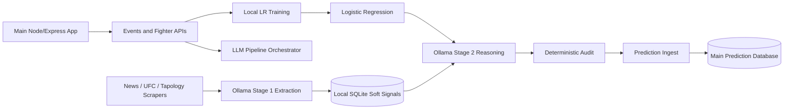

# UFC245 Tactical
## Local AI Fight Forecasting Evaluation and Recommendation Report

**Repository:** `westondunn/ufc245-tactical`  
**Branch reviewed:** `main`  
**Commit reviewed:** `0c3afc3fb48e37b1098f2febd1e86ec380cbc5a2`  
**Evaluation date:** 2026-08-08  
**Primary constraint:** All inference and model execution must run locally on a GPU with 12 GB VRAM  
**Intended audience:** Repository-maintenance agents, ML engineers, quality engineers, and model-evaluation agents  
**Assessment type:** Static architecture and source-code evaluation; no production database or 12 GB GPU benchmark was available during this review

---

# 1. Executive Summary

The repository has a useful operational foundation for a local fight-forecasting platform:

- A Node/Express application with SQLite/PostgreSQL support.
- A Python logistic-regression prediction service.
- A local Dockerized Ollama enrichment pipeline.
- News, UFC preview, and Tapology scraping.
- Provider abstraction for local or remote LLMs.
- Dry-run, audit, synchronization, and prediction-history concepts.
- GPU-aware Docker Compose configuration.
- Unit and smoke tests around the prediction and LLM pipeline.

The current design is not yet suitable for making trustworthy, calibrated fight forecasts. The primary limitations are in data validity, temporal evaluation, probability ownership, source provenance, and the separation between unstructured evidence extraction and numeric prediction.

The most important architectural correction is:

> **Ollama should extract, classify, normalize, and explain evidence. It should not generate the final numeric winner probability.**

The final probability should be produced by trained, point-in-time-safe numeric models and then calibrated using temporal out-of-fold predictions. Ollama can add value by turning articles, interviews, weigh-in reports, and fight previews into structured signals with immutable source evidence.

## Provisional readiness rating

The following score estimates readiness for **trustworthy, reproducible, calibrated forecasting**, not general application completeness.

| Domain | Weight | Provisional score, 0–5 | Weighted result |
|---|---:|---:|---:|
| Point-in-time data integrity | 18 | 1.5 | 5.4 |
| Validation and experimental design | 15 | 1.0 | 3.0 |
| Winner-model quality and calibration | 15 | 2.0 | 6.0 |
| Ollama evidence pipeline | 12 | 2.5 | 6.0 |
| Method and round modeling | 8 | 1.0 | 1.6 |
| Local GPU runtime engineering | 8 | 2.5 | 4.0 |
| MLOps and reproducibility | 8 | 2.0 | 3.2 |
| Testing and quality gates | 8 | 2.5 | 4.0 |
| Observability | 5 | 2.0 | 2.0 |
| Security and governance | 3 | 2.5 | 1.5 |
| **Total** | **100** |  | **36.7 / 100** |

This is a code-only baseline. An evaluation agent must replace these provisional scores with evidence from the current repository, populated data, historical replay, and local GPU measurements.

## Recommended outcome

Keep the existing application and orchestration foundation, but redesign the prediction path around five controls:

1. **Point-in-time feature construction** with explicit prediction cutoffs.
2. **Event-grouped walk-forward evaluation** instead of shuffled cross-validation.
3. **Numeric champion/challenger models** such as symmetric logistic regression, CatBoost GPU, and dynamic Bradley–Terry ratings.
4. **Versioned Ollama evidence extraction** with structured schemas, source snapshots, evidence offsets, and deterministic validation.
5. **Out-of-fold stacking and calibration** before probabilities are published.

---

# 2. Purpose and Agent Use

This document serves two purposes:

1. Define the target technical and quality architecture for local UFC fight forecasting.
2. Give an autonomous or assisted engineering agent a repeatable contract for evaluating whether repository changes are actual improvements.

An agent using this report must not equate any of the following with a forecasting improvement:

- A larger local language model.
- More confident rationale text.
- Better-looking explanations.
- Higher training accuracy.
- Better results on a randomly shuffled split.
- Better results on a holdout repeatedly used for tuning.
- A single successful event.
- A higher percentage of predictions above 70% confidence.

An improvement must be supported by reproducible evidence from temporal holdouts, proper scoring rules, calibration analysis, leakage controls, quality gates, and runtime measurements.

---

# 3. Scope and Limitations

## Included

- Current winner-prediction model design.
- Current LLM extraction and reasoning pipeline.
- Docker and GPU configuration.
- Data flow and historical feature construction.
- Model evaluation and calibration strategy.
- Method and round forecasting.
- Source provenance and cache behavior.
- Testing, observability, governance, and model promotion.
- A structured protocol for future agents to assess changes.

## Excluded from direct verification

- Accuracy against the populated production database.
- Real GPU memory consumption and throughput on the target 12 GB card.
- Current scraping availability or site terms at runtime.
- Quality of historical source coverage.
- Licensing suitability of every candidate model weight.
- Profitability, betting edge, or wagering recommendations.

Any agent performing the next evaluation must verify these items rather than inheriting assumptions from this report.

---

# 4. Current Architecture

The current repository implements a two-layer prediction approach:

1. A regularized logistic-regression model uses engineered fighter and career statistics.
2. A local Ollama pipeline extracts qualitative signals and asks the LLM to produce a final ensemble winner, probability, method, round, rationale, and insights.

## Current logical flow



## Current strengths

- Baseline LR remains available when the local LLM is offline.
- LLM calls are abstracted behind a provider interface.
- Stage 1 extraction and Stage 2 reasoning are separated.
- Scraped source content is cached locally.
- Dry-run and audit concepts exist.
- Predictions carry a model version and explanation payload.
- A GPU Compose overlay exists.
- Prediction history and enrichment levels are represented in the main application.
- Tests exist around providers, extraction, reasoning, orchestration, audit, and model behavior.

These are useful foundations and should be preserved where possible.

---

# 5. Findings Register

## F-001 — Historical feature leakage through current fighter profiles

**Severity:** Critical  
**Category:** Data integrity  
**Evidence locations:**

- `llm-pipeline/pipeline/train.py`
- `server.js`, career-stats route
- `db/postgres.js`, `getCareerStats`
- `db/sqlite.js`, equivalent career-stat logic
- `ufc245-predictions/model/__init__.py`

### Observation

Training requests career statistics using an `as_of` date, but the response also includes the current fighter profile. The feature builder consumes profile fields such as striking pace, striking defense, and takedown defense. Those fields can reflect fights that occurred after the historical event being modeled.

### Risk

- Future information can leak into historical training rows.
- Cross-validation results can be materially inflated.
- Model comparisons become invalid.
- A candidate model may appear better only because it exploits leaked information.

### Recommendation

Create one authoritative point-in-time feature service:

```text
build_matchup_features(
    red_fighter_id,
    blue_fighter_id,
    prediction_cutoff_timestamp
)
```

All dynamic performance statistics must be recomputed from fights strictly before the cutoff. Current profile rows should only provide effectively static attributes such as height, reach, stance, date of birth, and nationality.

### Acceptance criteria

- Every dynamic feature has a maximum source timestamp strictly earlier than the prediction cutoff.
- Modifying or adding future fights does not change a historical feature vector.
- Feature artifacts record `prediction_cutoff`, `max_source_timestamp`, `feature_schema_version`, and `source_query_hash`.
- A leakage test runs in CI and fails on any historical mutation.

---

## F-002 — Shuffled cross-validation does not represent future forecasting

**Severity:** Critical  
**Category:** Evaluation design  
**Evidence location:** `ufc245-predictions/model/__init__.py`

### Observation

The current LR uses shuffled `StratifiedKFold` and reports accuracy.

### Risk

- Later fights can influence a model evaluated against earlier fights.
- Repeat fighters can appear on both sides of a random split.
- Event context can leak across folds.
- Accuracy alone does not measure probability quality.

### Recommendation

Use event-grouped walk-forward evaluation:

```text
Fold 1: Train through event N        -> Validate events N+1 through N+K
Fold 2: Train through event N+K      -> Validate events N+K+1 through N+2K
Fold 3: Continue chronologically
```

All fights from the same event must remain in the same fold. Hyperparameter tuning must occur only inside the historical training window.

### Acceptance criteria

- No validation event precedes the latest training event in a fold.
- No event is split between train and validation.
- Final holdout data is not used for tuning.
- Results include log loss, Brier score, calibration, accuracy, AUC, and event-bootstrap confidence intervals.

---

## F-003 — Ollama owns the final numeric probability

**Severity:** Critical  
**Category:** Forecast validity  
**Evidence locations:**

- `llm-pipeline/prompts/reason.md`
- `llm-pipeline/pipeline/reason.py`
- `llm-pipeline/pipeline/orchestrator.py`

### Observation

Stage 2 asks the LLM to return the final winner and win probability. The output is validated syntactically and clamped, but it is not learned or calibrated against historical outcomes.

### Risk

- Probabilities are not statistically calibrated.
- Prompt changes can alter forecasts without retraining or evaluation.
- Model upgrades can silently change confidence behavior.
- Explanations can influence numeric outputs inconsistently.
- A fluent rationale may create false confidence.

### Recommendation

The numeric forecasting layer must own:

- Winner probability.
- Method distribution.
- Round or time-to-finish distribution.
- Calibration.

Ollama may generate a rationale only after numeric outputs are frozen. It must not be permitted to modify the numeric prediction.

### Acceptance criteria

- Numeric probabilities are generated without an LLM call.
- Removing Ollama produces the same numeric prediction.
- Prompt or LLM-model changes cannot change winner probabilities.
- The published payload labels evidence enrichment separately from numeric model version.

---

## F-004 — Source provenance is lost before Stage 2

**Severity:** Critical  
**Category:** Evidence governance  
**Evidence locations:**

- `llm-pipeline/db/schema.sql`
- `llm-pipeline/db/store.py`
- `llm-pipeline/pipeline/reason.py`
- `llm-pipeline/prompts/reason.md`

### Observation

The stored signal records do not carry a stable source snapshot identifier into Stage 2. The LLM is expected to provide a source label from a controlled list.

### Risk

- Source labels can be invented or misattributed.
- Evidence cannot be reliably traced to immutable content.
- Article edits can invalidate previous interpretations.
- Auditors cannot reproduce why a signal was accepted.

### Recommendation

Preserve immutable source metadata outside the LLM:

```text
source_snapshot_id
canonical_url
publisher
published_at
fetched_at
body_sha256
prediction_cutoff
```

The LLM should return evidence offsets and structured classification only. The orchestrator should attach source identity.

### Acceptance criteria

- Every non-model insight links to exactly one immutable source snapshot.
- Publisher and URL are never generated by the LLM.
- Evidence text matches the stored source range.
- Source publication time is before the prediction cutoff.

---

## F-005 — Cache invalidation can preserve stale signals

**Severity:** Critical  
**Category:** Data consistency  
**Evidence locations:**

- `llm-pipeline/pipeline/extract.py`
- `llm-pipeline/db/store.py`

### Observation

Source content is updated in the cache before a successful extraction is guaranteed. If extraction fails after the source body changes, a subsequent run can treat the new body as unchanged while old signals remain associated with the source.

### Risk

- Stale signals can survive article changes.
- An outdated injury or matchup claim can affect later predictions.
- Failed extraction is not distinguishable from valid cached extraction.

### Recommendation

Use a versioned extraction-run record and transaction:

```text
1. Create extraction_run for body hash + prompt + schema + model digest.
2. Run extraction.
3. Validate schema, entity mapping, and evidence offsets.
4. Atomically persist the new signal set.
5. Mark extraction_run successful.
6. Commit.
```

Do not associate old signals with a new body hash.

### Acceptance criteria

- Failed extraction never changes the active successful signal set.
- Changing content forces a new extraction run.
- Changing prompt, schema, model tag, or model digest forces re-extraction.
- Cache behavior has explicit unit and integration tests.

---

## F-006 — Article text is truncated instead of retrieved by relevance

**Severity:** High  
**Category:** LLM data preparation  
**Evidence location:** `llm-pipeline/pipeline/extract.py`

### Observation

Only the first portion of article text is sent to the LLM.

### Risk

- Relevant information later in an article is omitted.
- Long interviews and weigh-in reports can be misclassified.
- Token use is not aligned to relevance.

### Recommendation

Use local chunking and retrieval:

1. Normalize and clean HTML.
2. Split into 800–1,200-token chunks with overlap.
3. Resolve fighter aliases.
4. Generate local embeddings.
5. Retrieve the most relevant chunks.
6. Extract signals from only those chunks.
7. Preserve chunk and character offsets.

### Acceptance criteria

- Golden tests include relevant facts near article endings.
- Retrieval recall is measured separately from extraction recall.
- Every signal references the exact retrieved chunk and source offsets.

---

## F-007 — Feature representation contains redundant corner values and deltas

**Severity:** High  
**Category:** Model design  
**Evidence location:** `ufc245-predictions/model/__init__.py`

### Observation

Many feature groups contain red value, blue value, and exact red-minus-blue delta.

### Risk

- Strong collinearity in LR.
- Unstable coefficients.
- Increased corner bias.
- Harder interpretation and maintenance.

### Recommendation

Use a symmetric matchup representation, primarily deltas and explicitly justified context features. Add corner-swap augmentation and invariance testing.

### Acceptance criteria

```text
P(A beats B) approximately equals 1 - P(B beats A)
```

- Mean absolute swap error is below 0.01.
- P99 swap error is below 0.03.
- Any retained corner prior is explicit and independently evaluated.

---

## F-008 — Missing values are converted to zero

**Severity:** High  
**Category:** Feature integrity  
**Evidence location:** `ufc245-predictions/model/__init__.py`

### Observation

Missing or invalid values are generally converted to zero.

### Risk

Unknown can be interpreted as no activity, no defense, no reach, or no experience. This is particularly harmful for debutants and fighters with incomplete statistics.

### Recommendation

- Preserve missing values for models that support them.
- Add missingness indicators.
- Use model-specific imputation fit only on each training fold.
- Track feature completeness per prediction.
- Consider abstention or wider uncertainty when critical data is absent.

### Acceptance criteria

- Missingness behavior is documented by feature.
- Imputation statistics are learned from training data only.
- Performance is reported separately for debutants and incomplete records.

---

## F-009 — Method and round are generated independently by the LLM

**Severity:** High  
**Category:** Outcome modeling  
**Evidence locations:**

- `llm-pipeline/prompts/reason.md`
- `llm-pipeline/pipeline/reason.py`

### Observation

The LLM emits one method and one round with a method confidence.

### Risk

- Winner, method, and round distributions can be incoherent.
- Uncertainty is discarded.
- Decision and finish probabilities are not constrained to a joint distribution.

### Recommendation

Start with six mutually exclusive outcomes:

```text
red_ko_tko
red_submission
red_decision
blue_ko_tko
blue_submission
blue_decision
```

Then derive winner probability from the class distribution. Model round conditional on a finish, or introduce a discrete-time competing-risk model when data volume supports it.

### Acceptance criteria

- Outcome probabilities sum to one.
- Winner probability equals the sum of that fighter's method probabilities.
- Decision predictions do not contain a finish round.
- Method and round are evaluated with proper probabilistic metrics.

---

## F-010 — Fight concurrency can exceed practical 12 GB GPU capacity

**Severity:** High  
**Category:** Runtime reliability  
**Evidence locations:**

- `llm-pipeline/config.py`
- `llm-pipeline/pipeline/orchestrator.py`
- `docker-compose.gpu.yml`

### Observation

The orchestrator can process several fights concurrently, and each fight can reach Ollama.

### Risk

- Multiple simultaneous contexts can exhaust VRAM.
- Ollama can partially offload to CPU and create unpredictable latency.
- Event processing can fail under the exact workload it is designed to handle.

### Recommendation

Separate concurrency domains:

- CPU/network queue: 4 or more workers.
- GPU-generation queue: 1 worker on a 12 GB GPU until benchmarked otherwise.
- Embedding batch queue: separate from generative inference.

### Acceptance criteria

- A full event card completes without out-of-memory errors.
- The selected model remains fully GPU-resident during generation.
- Queue depth, wait time, load duration, and token throughput are observable.
- Failure falls back to a quantitative-only prediction.

---

## F-011 — Runtime and model versions are insufficiently pinned

**Severity:** High  
**Category:** Reproducibility  
**Evidence locations:**

- `docker-compose.yml`
- `llm-pipeline/pyproject.toml`
- `.env.local.example`

### Observation

Ollama uses a floating container tag, and the model configuration is primarily a mutable model name.

### Risk

- Rebuilding can change runtime behavior without code changes.
- Model weights can change under the same logical tag.
- Results cannot be reproduced reliably.

### Recommendation

Record and pin:

```text
ollama_server_image_digest
ollama_client_version
model_name
model_digest
quantization
num_ctx
prompt_sha256
schema_version
feature_schema_version
training_data_cutoff
code_commit
```

### Acceptance criteria

- The same artifact bundle can reproduce the same deterministic extraction result.
- Every published prediction includes numeric model and evidence-model lineage.
- An agent can compare two runs and identify all changed components.

---

## F-012 — Accuracy is overemphasized and calibration is not first-class

**Severity:** High  
**Category:** Model evaluation

### Observation

The current evaluation emphasizes accuracy and limited method accuracy.

### Risk

A model can have similar accuracy but badly overstate confidence. A forecasting system should be judged by probability quality, not only correct picks.

### Recommendation

Primary winner metrics:

- Log loss.
- Brier score.
- Calibration slope and intercept.
- Reliability diagram.
- Expected calibration error.

Secondary metrics:

- Accuracy.
- ROC-AUC.
- Precision/recall by confidence band.
- Coverage and abstention.

### Acceptance criteria

- No model is promoted based on accuracy alone.
- Confidence bands include observed win rate and sample count.
- Calibration is measured on data not used to fit the base model.

---

## F-013 — Qualitative signals are not historically backtested

**Severity:** High  
**Category:** Evidence modeling

### Observation

The design primarily learns forward from upcoming sources. There is no established historical corpus of articles and source-grounded labels before past fight cutoffs.

### Risk

- The system cannot learn how much a signal should affect probability.
- Signal severity can be interpreted arbitrarily.
- Source bias and duplicated reporting can be mistaken for independent evidence.

### Recommendation

Until historical backfill exists, qualitative signals should be:

- Displayed as cited evidence.
- Used to trigger review or lower confidence under an explicit policy.
- Kept out of calibrated probability generation.

After backfill, convert signals into deterministic numeric features and validate them temporally.

### Acceptance criteria

- Every historical signal was published before its fight cutoff.
- Duplicate syndication is not counted as independent corroboration.
- Signal-value contribution is learned from historical data rather than prompt instruction.

---

## F-014 — Model registry and promotion evidence are incomplete

**Severity:** Medium  
**Category:** MLOps

### Observation

Model artifacts and versions exist, but a complete experiment, evaluation, calibration, and promotion registry is not evident.

### Recommendation

Create a local registry containing:

```text
experiment_id
code_commit
training_cutoff
feature_schema_hash
training_dataset_hash
fold_definition_hash
hyperparameters
base_model_artifacts
stacker_artifact
calibrator_artifact
metrics_by_fold
metrics_by_slice
confidence_intervals
promotion_decision
approver_or_agent
```

### Acceptance criteria

- Every champion prediction resolves to a complete registry record.
- Challenger results can be reproduced from the registry.
- Rollback requires only selecting the previous approved registry entry.

---

## F-015 — Audit rules are useful but not substitutes for calibration

**Severity:** Medium  
**Category:** Quality controls  
**Evidence location:** `llm-pipeline/pipeline/audit.py`

### Observation

The deterministic audit checks rationale length, large probability shifts, winner flips, signal severity, and internal consistency.

### Strength

This is a useful publication control and should remain.

### Risk

Heuristic limits such as probability-delta thresholds do not establish statistical validity. A fluent but unsupported prediction can still pass, while a valid numeric shift can be blocked by missing narrative evidence.

### Recommendation

Separate controls:

- **Numeric model gates:** leakage, temporal performance, calibration, data completeness.
- **Evidence gates:** provenance, offsets, entity resolution, source cutoff, contradiction.
- **Narrative gates:** consistency and unsupported-claim detection.

### Acceptance criteria

- Narrative quality cannot promote a numerically failing model.
- Numeric model validity does not depend on rationale length.
- Each gate produces an independent result.

---

## F-016 — Current tests do not prove forward predictive quality

**Severity:** Medium  
**Category:** Testing  
**Evidence locations:**

- `ufc245-predictions/tests/test_model.py`
- `llm-pipeline/tests/`

### Observation

Existing tests provide useful smoke and unit coverage, but the model tests largely use synthetic data, and no full historical replay contract is established.

### Recommendation

Add:

- Point-in-time leakage tests.
- Event-grouped replay tests.
- Swap-invariance tests.
- Extraction golden sets.
- Source cutoff and provenance tests.
- Cache invalidation tests.
- Calibration regression tests.
- Full-card 12 GB GPU capacity tests.
- Numeric-only fallback tests.

### Acceptance criteria

All promotion gates are executable and produce machine-readable results.

---

## F-017 — Publication timestamp and prediction cutoff must be first-class

**Severity:** Critical  
**Category:** Temporal data governance

### Observation

Source fetching and extraction records do not consistently establish that a source existed before the prediction was made.

### Risk

Post-fight recaps, late article edits, or future information can leak into historical backtests.

### Recommendation

Every source snapshot and extraction must include:

```text
published_at
first_seen_at
fetched_at
prediction_cutoff
article_version
```

### Acceptance criteria

- `published_at < prediction_cutoff` for every signal used in a prediction.
- Sources without a defensible publication time are excluded from calibrated historical training.
- Backtests use the source version available at the historical cutoff.

---

# 6. Target Architecture

```mermaid
flowchart LR
    subgraph Sources
        UFC[UFC Fight and Round Statistics]
        META[Fighter Metadata]
        NEWS[News / Interviews / Weigh-ins]
        ODDS[Optional Market Baseline]
    end

    subgraph PIT[Point-in-Time Data Layer]
        SNAP[Immutable Source Snapshots]
        FEATURES[Historical Feature Builder]
        RATINGS[Dynamic Fighter Ratings]
        MANIFEST[Prediction Input Manifest]
    end

    subgraph LOCAL_LLM[Local Ollama Evidence Pipeline]
        CLEAN[Clean and Chunk]
        RETRIEVE[Local Embedding Retrieval]
        EXTRACT[Schema-Constrained Extraction]
        VERIFY[Entity and Evidence Validation]
        SIGNALS[Versioned Structured Signals]
    end

    subgraph NUMERIC[Numeric Forecasting]
        LR[Symmetric Logistic Baseline]
        CAT[CatBoost GPU]
        BT[Dynamic Bradley-Terry]
        TPFN[Optional TabPFN Challenger]
        SOFT[Deterministic Signal Encoder]
        STACK[Out-of-Fold Stacker]
        CAL[Probability Calibrator]
        METHOD[Joint Method Model]
        ROUND[Round / Time-to-Finish Model]
    end

    subgraph PUBLISH[Publication and Governance]
        NARRATIVE[Grounded Ollama Narrative]
        GATES[Independent Quality Gates]
        REGISTRY[Prediction and Model Registry]
        API[Main Application API]
    end

    UFC --> FEATURES
    META --> FEATURES
    UFC --> RATINGS
    NEWS --> SNAP
    SNAP --> CLEAN
    CLEAN --> RETRIEVE
    RETRIEVE --> EXTRACT
    EXTRACT --> VERIFY
    VERIFY --> SIGNALS
    FEATURES --> MANIFEST
    RATINGS --> MANIFEST
    SIGNALS --> MANIFEST

    MANIFEST --> LR
    MANIFEST --> CAT
    MANIFEST --> BT
    MANIFEST --> TPFN
    SIGNALS --> SOFT
    LR --> STACK
    CAT --> STACK
    BT --> STACK
    TPFN --> STACK
    SOFT --> STACK
    STACK --> CAL
    MANIFEST --> METHOD
    MANIFEST --> ROUND

    CAL --> NARRATIVE
    METHOD --> NARRATIVE
    ROUND --> NARRATIVE
    SIGNALS --> NARRATIVE
    NARRATIVE --> GATES
    CAL --> GATES
    METHOD --> GATES
    ROUND --> GATES
    GATES --> REGISTRY
    REGISTRY --> API
```



## Architectural rule

`NARRATIVE` is downstream and read-only with respect to numeric forecasts. A narrative-generation failure must not modify or suppress the quantitative forecast.

---

# 7. Recommended Numeric Model Portfolio

## 7.1 Symmetric logistic-regression baseline

Retain LR as the explainable baseline, but redesign the feature vector.

### Recommended feature pattern

```text
striking_output_delta
striking_absorption_delta
striking_accuracy_delta
striking_defense_delta
takedown_attempt_rate_delta
takedown_success_delta
takedown_defense_delta
control_share_delta
submission_attempt_rate_delta
knockdown_rate_delta
opponent_adjusted_rating_delta
age_delta
reach_delta
height_delta
activity_delta
layoff_delta
ufc_experience_delta
five_round_experience_delta
```

### Required controls

- Red/blue swap augmentation.
- Explicit corner indicator only if justified.
- Fold-local preprocessing.
- Regularization tuning inside temporal training windows.
- Calibration after out-of-fold inference.

## 7.2 CatBoost GPU champion candidate

CatBoost is the recommended nonlinear candidate for the 12 GB GPU because it handles:

- Nonlinear interactions.
- Missing values.
- Categorical variables.
- Small-to-medium tabular datasets.
- Weight class, stance, experience, and style interactions.

Suggested initial configuration for experimentation:

```python
CatBoostClassifier(
    loss_function="Logloss",
    eval_metric="Logloss",
    task_type="GPU",
    depth=5,
    learning_rate=0.03,
    iterations=1500,
    l2_leaf_reg=8,
    random_seed=42,
    allow_writing_files=False,
)
```

This is a starting point, not an approved configuration. Hyperparameters must be selected using nested temporal validation.

## 7.3 Dynamic Bradley–Terry model

Use a dynamic paired-comparison rating as a complementary model and feature source.

Recommended ratings:

```text
overall_strength
striking_strength
grappling_strength
durability
finishing_strength
opponent_quality
```

The rating model should include:

- Time decay.
- Uncertainty or shrinkage for limited history.
- Strength of schedule.
- Weight-class transitions.
- Inactivity handling.

Use rating differences as CatBoost and stacker inputs rather than treating a simple Elo score as the complete forecast.

## 7.4 Optional TabPFN challenger

Benchmark TabPFN only after leakage-free temporal evaluation is available.

Evaluation requirements:

- Verify model-weight licensing for the intended use.
- Measure 12 GB VRAM consumption.
- Compare log loss, Brier score, calibration, and latency.
- Treat it as a challenger until it consistently improves temporal holdouts.

## 7.5 Out-of-fold stacker

The stacker must be trained only on predictions generated while each fight was out of the base model's training set.

Recommended inputs:

```text
p_lr
p_catboost
p_bradley_terry
p_tabpfn_optional
feature_completeness
fighter_history_depth
rating_uncertainty
structured_soft_signal_features
```

Use a small regularized logistic model for the initial stacker.

## 7.6 Calibration

Fit calibration after base-model and stacker training.

Preferred initial approach:

- Sigmoid calibration for smaller datasets.
- Isotonic only when calibration sample volume is sufficient.
- Calibration trained on a later temporal segment than the base model.
- Final untouched holdout for reporting only.

Store the calibrator as a separately versioned artifact.

---

# 8. Method and Round Forecasting

## Initial joint method model

Train a six-class model:

```text
red_ko_tko
red_submission
red_decision
blue_ko_tko
blue_submission
blue_decision
```

Derive:

```text
P(red wins) = P(red_ko_tko) + P(red_submission) + P(red_decision)
P(blue wins) = P(blue_ko_tko) + P(blue_submission) + P(blue_decision)
```

## Round model

For finish outcomes, predict a round distribution conditional on:

- Winner side.
- Method.
- Scheduled rounds.
- Fighter pace and finishing history.
- Opponent durability and defense.
- Weight class.

## Advanced competing-risk model

When data volume supports it, model discrete time hazards for:

```text
red_ko_tko
blue_ko_tko
red_submission
blue_submission
```

Decision probability is the probability of surviving through the scheduled end.

## Quality requirements

- Joint probabilities sum to one.
- Winner probability is mathematically consistent with method probabilities.
- Decision has no finish round.
- Three-round and five-round bouts use different horizons.
- Evaluate method with multiclass log loss and Brier score.
- Evaluate round or time with ranked probability score or time-dependent Brier score.

---

# 9. Recommended Ollama Responsibilities

## Allowed responsibilities

- Document relevance classification.
- Fighter and alias resolution assistance.
- Structured signal extraction.
- Claim type classification.
- Negation and temporality detection.
- Rumor versus confirmed-fact classification.
- Contradiction detection.
- Deduplication assistance.
- Source-grounded explanation generation.
- Human-readable summary of frozen numeric outputs.

## Prohibited responsibilities

- Generating final winner probability.
- Generating calibrated confidence.
- Overriding numeric model output.
- Inventing publisher, URL, publication date, or source identity.
- Treating unsupported narrative as evidence.
- Using post-cutoff material in historical replay.

---

# 10. Structured Ollama Extraction Contract

## Recommended Pydantic schema

```python
from datetime import datetime
from typing import Literal
from pydantic import BaseModel, Field


class ExtractedSignal(BaseModel):
    fighter_id: int

    signal_type: Literal[
        "injury_confirmed",
        "injury_rumor",
        "weight_miss",
        "weight_cut_concern",
        "short_notice",
        "opponent_change",
        "camp_change",
        "layoff",
        "weight_class_change",
        "travel_issue",
        "weigh_in_observation",
        "style_observation",
        "recent_form",
        "other",
    ]

    direction: Literal["positive", "negative", "neutral", "unknown"]
    severity: int = Field(ge=0, le=3)
    confidence: float = Field(ge=0.0, le=1.0)

    evidence_quote: str
    evidence_start: int = Field(ge=0)
    evidence_end: int = Field(gt=0)

    observed_at: datetime | None = None
    valid_until: datetime | None = None


class ExtractionResult(BaseModel):
    relevant: bool
    signals: list[ExtractedSignal]
```

## Required post-processing

```python
quote = article_body[signal.evidence_start:signal.evidence_end]
assert normalize(quote) == normalize(signal.evidence_quote)
```

The validator must also confirm:

- `fighter_id` belongs to the fight scope.
- The signal is not based on instruction-like text inside the source.
- The source publication time precedes the prediction cutoff.
- The evidence is not merely a speculative question unless classified as rumor.
- Historical facts are not interpreted as current unless temporal language supports it.

---

# 11. Source and Cache Data Model

## `source_snapshot`

```text
id
canonical_url
publisher
published_at
first_seen_at
fetched_at
body_sha256
body
article_version
prediction_cutoff
```

## `extraction_run`

```text
id
source_snapshot_id
model_name
model_digest
ollama_runtime_digest
prompt_sha256
schema_version
num_ctx
started_at
completed_at
status
latency_ms
prompt_tokens
completion_tokens
error_code
```

## `soft_signal`

```text
id
extraction_run_id
source_snapshot_id
fight_id
fighter_id
signal_type
direction
severity
confidence
evidence_start
evidence_end
observed_at
valid_until
```

## Cache identity

```text
body_sha256
+ model_digest
+ prompt_sha256
+ schema_version
+ fighter_scope_hash
+ extraction_policy_version
```

The active signal set must reference the latest successful extraction for that complete identity. A failed extraction must never replace a successful one.

---

# 12. Article Retrieval and Classification

## Pipeline

1. Fetch and normalize the source.
2. Store an immutable snapshot.
3. Extract visible article text.
4. Split into token-bounded chunks.
5. Resolve fighter aliases.
6. Generate local embeddings.
7. Retrieve the highest-relevance chunks.
8. Run schema-constrained Ollama extraction.
9. Validate evidence offsets and entities.
10. Deduplicate signals by claim and source family.
11. Detect contradictions and corroboration.
12. Persist the successful extraction run.

## Local embedding model requirements

The selected embedding model must:

- Fit alongside the operational workload or be loaded separately.
- Run locally.
- Be pinned by model digest.
- Have a measured retrieval golden set.
- Be unloaded before loading a larger generative model when VRAM requires it.

## Corroboration policy

Multiple articles must not automatically count as multiple independent sources. The pipeline should identify:

- Syndicated copies.
- Articles quoting the same original interview.
- Recaps based on one upstream report.
- Independent first-party confirmation.

Store both `article_count` and `independent_source_count`.

---

# 13. Deterministic Soft-Signal Features

After a valid historical source corpus exists, convert structured signals into numeric features such as:

```text
red_confirmed_injury_count
blue_confirmed_injury_count
confirmed_injury_severity_delta
injury_rumor_count_delta
weight_cut_concern_delta
short_notice_days_delta
opponent_change_count_delta
camp_change_recency_delta
layoff_signal_delta
weight_class_change_delta
weigh_in_negative_signal_delta
independent_source_count_delta
source_reliability_weighted_delta
signal_recency_weighted_delta
contradiction_flag
minimum_extraction_confidence
```

Rules:

- Feature engineering must be deterministic.
- LLM confidence is not treated as calibrated probability.
- Signal features are learned by numeric models.
- Source reliability weights must be defined, versioned, and evaluated.
- Missing historical source coverage must be represented explicitly.

---

# 14. 12 GB GPU Runtime Profile

## Recommended deployment policy

```yaml
services:
  ollama:
    image: ollama/ollama:<tested-version-or-digest>
    environment:
      OLLAMA_MAX_LOADED_MODELS: "1"
      OLLAMA_NUM_PARALLEL: "1"
      OLLAMA_CONTEXT_LENGTH: "4096"
      OLLAMA_MAX_QUEUE: "16"
      OLLAMA_KEEP_ALIVE: "15m"
```

## Model-selection strategy

Benchmark at least:

| Function | Candidate class | Selection rule |
|---|---|---|
| Extraction | 4B–8B instruct model | Highest grounded extraction F1 within runtime SLO |
| Adjudication | 8B–12B instruct model | Use only if measured quality gain justifies latency and VRAM |
| Embeddings | Small local embedding model | Highest retrieval recall within memory budget |
| Winner model | CatBoost GPU | Promote only through temporal metric gates |
| Challenger | TabPFN or alternative tabular model | License, VRAM, and temporal improvement required |

Do not select a model from parameter count alone.

## Concurrency design

```text
network_scrape_workers = 4 to 8
gpu_generation_workers = 1
embedding_batch_workers = measured independently
numeric_model_workers = CPU/GPU capacity based
```

## Required measurements

- GPU model residency.
- Peak VRAM.
- Average and P95 GPU queue wait.
- P50 and P95 extraction latency.
- Prompt and completion tokens.
- Token throughput.
- Model load duration.
- Full-event-card completion time.
- Out-of-memory count.
- CPU-offload occurrence.
- Failure and retry rate.

---

# 15. Evaluation Framework

## 15.1 Dataset manifest

Every evaluation run must emit a dataset manifest containing:

```text
manifest_id
repository_commit
database_snapshot_hash
minimum_event_date
maximum_event_date
prediction_cutoff_policy
source_snapshot_cutoff_policy
feature_schema_hash
number_of_events
number_of_fights
number_of_labeled_fights
number_of_debutants
missingness_summary
class_distribution
```

## 15.2 Temporal fold manifest

Each fold must record:

```text
fold_id
train_event_range
validation_event_range
train_fight_ids_hash
validation_fight_ids_hash
preprocessing_artifact_hash
hyperparameter_search_id
```

## 15.3 Winner metrics

Required:

- Log loss.
- Brier score.
- Calibration slope.
- Calibration intercept.
- Expected calibration error.
- Reliability table.
- Accuracy.
- ROC-AUC.

## 15.4 Method metrics

Required:

- Multiclass log loss.
- Multiclass Brier score.
- Macro F1.
- Per-class precision and recall.
- Confusion matrix.

## 15.5 Round and time metrics

Required:

- Ranked probability score.
- Mean absolute round error for conditional point predictions.
- Time-dependent Brier score for hazard models.
- Decision-survival calibration.

## 15.6 Slices

Report at minimum by:

- Weight class.
- Men's versus women's divisions when data supports it.
- Main event versus non-main event.
- Three-round versus five-round bout.
- Debutant versus established fighter.
- Low versus high historical-fight count.
- Complete versus incomplete feature records.
- Short notice.
- Weight-class change.
- Prediction confidence band.
- With versus without qualitative-source coverage.

## 15.7 Confidence intervals

Bootstrap by event, not by individual fight, to preserve within-event dependence.

Report:

- Mean metric.
- 95% confidence interval.
- Candidate-minus-baseline difference.
- Probability candidate improves the selected metric.

---

# 16. Champion/Challenger Promotion Gates

## Mandatory hard gates

| Gate | Requirement |
|---|---|
| PIT-1 | No known point-in-time leakage |
| PIT-2 | Future-data mutation tests pass |
| SPLIT-1 | Event-grouped temporal folds only |
| SPLIT-2 | Final holdout untouched during development |
| SYM-1 | Mean red/blue swap error below 0.01 |
| SYM-2 | P99 swap error below 0.03 |
| CAL-1 | Candidate calibration is no worse than baseline within tolerance |
| EVID-1 | Every qualitative signal has immutable source evidence |
| EVID-2 | Every source publication time precedes prediction cutoff |
| EVID-3 | Evidence-offset validation passes 100% for published signals |
| RUNTIME-1 | Full event completes without OOM on target 12 GB GPU |
| FALLBACK-1 | Ollama failure produces quantitative-only output |
| REPRO-1 | Complete artifact lineage is recorded |
| TEST-1 | Required unit, replay, extraction, and capacity suites pass |

## Performance gates

A candidate can be promoted only when all of the following are true:

1. Mean temporal holdout log loss improves over the current champion, or is demonstrably non-inferior while materially improving another approved objective.
2. Mean Brier score does not regress beyond the configured tolerance.
3. No recent validation fold suffers a catastrophic relative regression greater than the configured limit.
4. Calibration slope, intercept, and reliability remain acceptable.
5. Improvements are not isolated to one event or one data slice.
6. Results are reproducible from the registered artifacts.

## Default provisional thresholds

These are starting controls and must be adjusted after the baseline distribution is known:

```text
calibration_slope: 0.80 to 1.20
absolute_calibration_intercept: <= 0.10
expected_calibration_error: <= 0.07 or no worse than champion
recent_fold_relative_log_loss_regression: <= 10%
bootstrap_probability_candidate_improves_log_loss: >= 0.80
```

A small dataset may justify shadow deployment rather than immediate promotion even when thresholds pass.

## Verdicts

- `promote`: All hard gates pass and performance evidence supports replacement.
- `shadow`: Hard gates pass, but sample size or confidence is insufficient.
- `reject`: Any hard gate fails or performance materially regresses.
- `blocked`: Required data, hardware, or artifact evidence is unavailable.

---

# 17. Extraction Evaluation Framework

## Golden-set categories

The manually labeled corpus must include:

- Confirmed current injury.
- Injury rumor.
- Negated injury.
- Old injury no longer active.
- Opponent replacement.
- Short-notice acceptance.
- Weight miss.
- Weight-cut concern without an actual miss.
- Camp change.
- Layoff.
- Weight-class transition.
- Travel issue.
- Weigh-in visual observation.
- Style statement.
- Irrelevant article.
- Same-last-name ambiguity.
- Multiple fighters in one article.
- Contradictory sources.
- Syndicated duplicate reports.
- Prompt-injection-like text embedded in source content.

## Metrics

- Relevance precision and recall.
- Fighter assignment accuracy.
- Signal-type precision, recall, and F1.
- High-severity signal precision.
- Unsupported-signal rate.
- Evidence exact-match rate.
- Evidence-offset validity.
- Negation accuracy.
- Temporal-validity accuracy.
- Schema-valid response rate.
- Deterministic-repeat agreement.
- Latency and token use.

## Provisional extraction gates

```text
schema_validity >= 99.5%
evidence_offset_validity = 100% for published signals
unsupported_signal_rate <= 2%
high_severity_precision >= 90%
relevance_precision >= 90%
fighter_assignment_accuracy >= 98%
```

Recall targets should be set after the initial golden-set baseline, with high-impact signals prioritized over broad low-value recall.

---

# 18. Required Test Strategy

## 18.1 Data tests

- No source row after the prediction cutoff.
- No fight statistic after the prediction cutoff.
- Historical feature immutability after future data is added.
- Stable fighter identity and alias mapping.
- No duplicate fight rows.
- No event split across temporal folds.
- Feature missingness contract.
- Static versus dynamic profile-field classification.

## 18.2 Model tests

- Red/blue swap invariance.
- Probability sum and range.
- Deterministic inference from a fixed artifact.
- Fold-local preprocessing.
- No training IDs in validation IDs.
- Calibration artifact applies to the intended base model.
- Joint method probabilities sum to one.
- Winner and method distributions are coherent.

## 18.3 LLM tests

- Structured schema enforcement.
- Evidence-offset validation.
- Entity-scope enforcement.
- Negation handling.
- Historical-versus-current injury distinction.
- Prompt-injection resistance.
- Cache invalidation on body change.
- Cache invalidation on prompt change.
- Cache invalidation on model digest change.
- Failed extraction transaction behavior.
- Deterministic low-temperature repeatability.

## 18.4 Integration tests

- End-to-end historical replay.
- Numeric-only prediction with Ollama unavailable.
- Full enriched prediction with frozen numeric output.
- Prediction lineage from API response to registry.
- Main-app ingest and history behavior.
- Reconciliation after official result.
- Model rollback.

## 18.5 Performance and resilience tests

- Full 12-fight event card on 12 GB GPU.
- Maximum configured scrape concurrency.
- GPU queue backpressure.
- Ollama restart during an event run.
- Malformed model response.
- Slow source and timeout.
- Database write contention.
- Pending-sync recovery.
- Disk-full or low-disk warning for local caches.

---

# 19. Observability Requirements

## Prediction telemetry

```text
prediction_id
fight_id
numeric_model_version
calibrator_version
feature_manifest_id
prediction_cutoff
feature_completeness
raw_probability
calibrated_probability
method_distribution
round_distribution
abstention_reason
created_at
```

## Ollama telemetry

```text
extraction_run_id
model_name
model_digest
prompt_hash
schema_version
num_ctx
queue_wait_ms
load_duration_ms
prompt_tokens
completion_tokens
tokens_per_second
latency_ms
parse_status
validation_status
retry_count
fallback_used
```

## Model-health dashboards

- Predictions by model version.
- Prediction volume by confidence band.
- Observed win rate by confidence band.
- Rolling log loss and Brier score.
- Calibration drift.
- Feature completeness drift.
- Data-source coverage.
- Extraction failure rate.
- Unsupported-signal audit rate.
- GPU queue depth and P95 latency.
- CPU-offload and OOM events.

## Alerts

- Any point-in-time validation failure.
- Source published after cutoff.
- Full-GPU residency lost unexpectedly.
- Extraction schema validity below threshold.
- Calibration drift beyond control limits.
- Feature completeness drop.
- Numeric-only fallback rate spike.
- Model registry lineage missing.

---

# 20. Security and Governance

## Local-only inference policy

- No article content, fighter data, or predictions are sent to hosted LLM APIs.
- Provider fallback to cloud services must be disabled in the production-local profile.
- Network egress should be limited to approved data-source retrieval and main-app synchronization.
- Secrets must remain outside images and repositories.

## Source-content trust boundary

Treat all scraped content as untrusted input.

Controls:

- Clearly separate source text from system instructions.
- Do not permit source text to alter the extraction schema or policy.
- Reject tool-like or instruction-like outputs.
- Validate every entity and evidence offset.
- Store raw source snapshots for audit.
- Sanitize source content before rendering in the UI.

## Governance

- Verify scraper behavior against current site terms, robots directives, and rate limits.
- Track source removal requests and retention policy.
- Document model-weight licenses.
- Preserve attribution where required.
- Label predictions as probabilistic analytical outputs, not guarantees.

---

# 21. Recommended Repository Structure

```text
ufc245-tactical/
├── ml/
│   ├── data/
│   │   ├── point_in_time.py
│   │   ├── manifests.py
│   │   └── validation.py
│   ├── features/
│   │   ├── schema.py
│   │   ├── matchup.py
│   │   ├── ratings.py
│   │   └── soft_signals.py
│   ├── models/
│   │   ├── logistic.py
│   │   ├── catboost_model.py
│   │   ├── bradley_terry.py
│   │   ├── tabpfn_challenger.py
│   │   ├── stacker.py
│   │   ├── calibration.py
│   │   ├── method.py
│   │   └── round_hazard.py
│   ├── evaluation/
│   │   ├── temporal_folds.py
│   │   ├── metrics.py
│   │   ├── calibration_report.py
│   │   ├── slices.py
│   │   ├── bootstrap.py
│   │   └── promotion.py
│   └── registry/
│       ├── store.py
│       └── schema.py
├── llm-pipeline/
│   ├── schemas/
│   │   ├── extraction.py
│   │   └── narrative.py
│   ├── retrieval/
│   │   ├── chunking.py
│   │   ├── embeddings.py
│   │   └── search.py
│   ├── validation/
│   │   ├── evidence.py
│   │   ├── entities.py
│   │   ├── temporality.py
│   │   └── injection.py
│   ├── evals/
│   │   ├── golden_set.jsonl
│   │   ├── runner.py
│   │   └── report.py
│   └── providers/
│       └── ollama.py
├── artifacts/
│   ├── manifests/
│   ├── evaluations/
│   └── model-registry/
└── tests/
    ├── data/
    ├── models/
    ├── llm/
    ├── replay/
    └── capacity/
```

This can be introduced incrementally without immediately relocating every existing module.

---

# 22. Implementation Roadmap

## Phase 0 — Freeze the current baseline

### Deliverables

- Pin the current code commit and runtime configuration.
- Export the current feature schema.
- Record the current training dataset manifest.
- Run the current model through an event-grouped temporal evaluator without changing it.
- Label results as provisional if leakage remains.

### Exit criteria

- A reproducible baseline report exists.
- No future agent can claim improvement without comparing against that baseline.

---

## Phase 1 — Forecast validity

### Work

1. Build the point-in-time feature service.
2. Separate static and dynamic fighter attributes.
3. Add future-data mutation tests.
4. Replace shuffled CV with event-grouped walk-forward evaluation.
5. Add log loss, Brier, calibration, and slice reports.
6. Add corner-swap augmentation and metamorphic tests.
7. Disable Stage 2 LLM probability publication.

### Exit criteria

- All point-in-time gates pass.
- The corrected LR has a trustworthy temporal baseline.
- Numeric predictions are independent of Ollama.

---

## Phase 2 — Ollama evidence hardening

### Work

1. Add immutable source snapshots.
2. Introduce versioned extraction runs.
3. Replace prompt-only JSON with schema-constrained output.
4. Use fighter IDs rather than last-name strings.
5. Add evidence offsets and exact validation.
6. Add publication-time and prediction-cutoff controls.
7. Redesign cache identity and transaction behavior.
8. Add chunking, local embeddings, and retrieval.
9. Add a single-slot GPU generation queue.
10. Pin runtime and model digests.
11. Add extraction telemetry and golden-set evaluation.

### Exit criteria

- Every insight is typed, cited, reproducible, and cutoff-safe.
- Full event processing fits within the 12 GB GPU constraint.
- Ollama failure results in quantitative-only output.

---

## Phase 3 — Numeric ensemble

### Work

1. Add dynamic Bradley–Terry ratings.
2. Add CatBoost GPU.
3. Generate temporal out-of-fold base-model predictions.
4. Train a regularized stacker.
5. Add sigmoid calibration.
6. Register every artifact and evaluation.
7. Run champion/challenger shadow comparisons.

### Exit criteria

- Candidate passes all hard gates.
- Candidate improves or is acceptably non-inferior on temporal log loss and Brier score.
- Calibration is acceptable.
- Promotion decision is reproducible.

---

## Phase 4 — Method, round, and learned qualitative features

### Work

1. Add six-class winner/method forecasting.
2. Add conditional round distribution.
3. Backfill historical source snapshots.
4. Run the versioned Ollama extractor against historical pre-cutoff sources.
5. Add deterministic soft-signal features.
6. Benchmark TabPFN and competing-risk challengers.
7. Retrain, stack, and recalibrate.

### Exit criteria

- Method and round probabilities are coherent.
- Qualitative evidence affects probabilities only through learned temporal relationships.
- Improvements survive temporal holdouts and slice analysis.

---

## Phase 5 — Continuous model operations

### Work

- Scheduled data-quality checks.
- Scheduled temporal re-evaluation.
- Calibration monitoring.
- Champion/challenger registry.
- Automated shadow deployments.
- Drift and GPU-runtime dashboards.
- Controlled promotion and rollback.

### Exit criteria

- Model changes follow the same evidence-based promotion workflow as code changes.

---

# 23. Agent Evaluation Protocol

An agent evaluating a repository revision must execute the following process.

## Step 1 — Establish exact scope

Record:

```text
repository
base_commit
candidate_commit
branch
hardware
GPU model and VRAM
Ollama runtime digest
local model digests
database snapshot hash
source snapshot range
```

## Step 2 — Inventory changed prediction behavior

Classify each changed file as:

- Data acquisition.
- Point-in-time feature logic.
- Feature schema.
- Numeric model.
- Calibration.
- LLM prompt or schema.
- Source provenance.
- Runtime configuration.
- Tests.
- Observability.
- API or persistence.

## Step 3 — Re-run hard safety gates

Run all point-in-time, cutoff, symmetry, evidence, fallback, registry, and capacity tests before evaluating model quality.

If any hard gate fails, verdict must be `reject` or `blocked`. Do not continue to a promotion recommendation.

## Step 4 — Rebuild artifacts from scratch

The candidate must not reuse incompatible baseline preprocessing, calibration, prompt cache, or model artifacts.

Record every generated digest.

## Step 5 — Run identical temporal folds

Use the same frozen fold manifest for baseline and candidate unless the evaluation explicitly concerns a fold-policy change. A fold-policy change requires a separate methodological review.

## Step 6 — Compare metrics

Produce:

- Fold-by-fold metrics.
- Aggregate metrics.
- Event-bootstrap confidence intervals.
- Calibration report.
- Slice report.
- Runtime report.
- Extraction report when applicable.

## Step 7 — Diagnose causal source of change

An agent must state whether the observed change came from:

- Additional valid data.
- Leakage correction.
- Feature changes.
- Model changes.
- Calibration changes.
- Different fold composition.
- Different source coverage.
- LLM extraction changes.
- Random variance.

## Step 8 — Apply promotion gates

Return exactly one verdict:

```text
promote
shadow
reject
blocked
```

## Step 9 — Produce required artifacts

```text
evaluation-summary.md
scorecard.json
metric-comparison.csv
calibration-report.json
temporal-fold-results.csv
slice-results.csv
hard-gates.json
runtime-profile.json
extraction-eval.json, when applicable
artifact-manifest.json
```

## Step 10 — State residual uncertainty

The agent must distinguish:

- Verified improvement.
- Directional evidence.
- Insufficient sample size.
- Missing data.
- Unsupported assumption.

---

# 24. Required Agent Report Format

```markdown
# Candidate Evaluation

## Verdict
promote | shadow | reject | blocked

## Scope
- Base commit:
- Candidate commit:
- Hardware:
- Data manifest:
- Fold manifest:

## Executive finding
One evidence-based paragraph.

## Hard gates
| Gate | Result | Evidence |

## Metric comparison
| Metric | Baseline | Candidate | Delta | Confidence interval | Decision |

## Calibration
- Slope:
- Intercept:
- ECE:
- Reliability summary:

## Slice regressions
| Slice | Metric | Baseline | Candidate | Risk |

## Extraction quality
| Metric | Baseline | Candidate | Gate |

## Runtime
| Metric | Baseline | Candidate | Limit |

## Reproducibility
- Artifact manifest complete:
- Digests recorded:
- Re-run match:

## Risks and limitations

## Required follow-up
```

---

# 25. Agent Decision Rules

The evaluation agent must follow these rules:

1. Never claim improved forecasting from training metrics alone.
2. Never use randomly shuffled validation as promotion evidence.
3. Never accept a candidate with known point-in-time leakage.
4. Never let LLM rationale quality substitute for numeric calibration.
5. Never treat LLM confidence as a calibrated probability.
6. Never use post-cutoff source material in a historical replay.
7. Never count syndicated copies as independent corroboration.
8. Never promote a model when artifact lineage is incomplete.
9. Never hide slice regressions behind a better aggregate average.
10. Never tune against the final holdout.
11. Never claim local-only execution unless network calls and provider configuration were verified.
12. Never recommend a model solely because it is larger.
13. Mark missing evidence as `blocked`, not `passed`.
14. Preserve the current champion until promotion gates are satisfied.
15. Prefer shadow evaluation when sample size is insufficient.

---

# 26. Suggested Definition of Done

The forecasting platform is considered production-ready for its intended analytical purpose when:

- Historical features are demonstrably point-in-time correct.
- Temporal replay is automated and reproducible.
- Winner probabilities are calibrated and measured with proper scoring rules.
- Method and round outputs form a coherent distribution.
- Ollama produces only source-grounded structured evidence and narrative.
- Every qualitative claim links to immutable evidence.
- Every model and prompt is pinned and versioned.
- A full event card runs locally within 12 GB VRAM without OOM.
- Numeric-only fallback works.
- Champion/challenger promotion is automated and auditable.
- Drift, calibration, extraction quality, and GPU health are observable.
- Required tests and hard gates are enforced in CI or an equivalent local quality workflow.

---

# 27. Prioritized Next Actions

## Immediate

1. Remove the LLM-generated probability from the published prediction path.
2. Implement point-in-time-safe dynamic fighter statistics.
3. Build event-grouped walk-forward evaluation.
4. Add log loss, Brier score, calibration, and swap-invariance reporting.

## Next

5. Introduce immutable source snapshots and extraction-run versioning.
6. Add structured Ollama schemas and evidence-offset validation.
7. Separate CPU concurrency from one-slot GPU generation.
8. Pin Ollama and model digests.

## Then

9. Add CatBoost GPU and dynamic Bradley–Terry ratings.
10. Generate temporal out-of-fold predictions and train a stacker.
11. Add calibration and a local model registry.
12. Introduce joint method and round forecasting.

## Later

13. Backfill historical qualitative sources.
14. Learn deterministic signal effects.
15. Benchmark TabPFN and competing-risk challengers.
16. Automate model promotion, rollback, and drift monitoring.

---

# 28. Reference Material for Implementers

The implementation agent should verify current documentation and licensing before selecting versions. Useful primary references include:

- Ollama structured outputs: `https://docs.ollama.com/capabilities/structured-outputs`
- Ollama chat API and telemetry fields: `https://docs.ollama.com/api/chat`
- Ollama context and concurrency behavior: `https://docs.ollama.com/faq`
- Scikit-learn probability calibration: `https://scikit-learn.org/stable/modules/calibration.html`
- CatBoost ordered boosting paper: `https://proceedings.neurips.cc/paper/2018/hash/14491b756b3a51daac41c24863285549-Abstract.html`
- Dynamic Bradley–Terry sports modeling: `https://rss.onlinelibrary.wiley.com/doi/abs/10.1111/j.1467-9876.2012.01046.x`
- TabPFN research: `https://www.nature.com/articles/s41586-024-08328-6`
- DeepHit competing-risk research: `https://aaai.org/papers/11842-deephit-a-deep-learning-approach-to-survival-analysis-with-competing-risks/`

---

# 29. Final Recommendation

Do not begin by replacing the current 8B model with a larger Ollama model. The current bottleneck is not primarily language-model capability. It is the absence of a fully point-in-time-safe, temporally evaluated, calibrated forecasting pipeline.

The correct sequence is:

```text
valid historical data
-> temporal evaluation
-> trustworthy numeric baseline
-> nonlinear and rating challengers
-> out-of-fold stacking
-> calibration
-> grounded Ollama evidence
-> coherent method and round models
-> controlled promotion
```

Once these controls are in place, local model selection becomes measurable: the preferred Ollama model is the smallest model that passes extraction-quality gates within the 12 GB runtime budget. The preferred forecasting model is the candidate that passes all integrity gates and improves temporal probability quality—not the model that generates the most convincing narrative.
